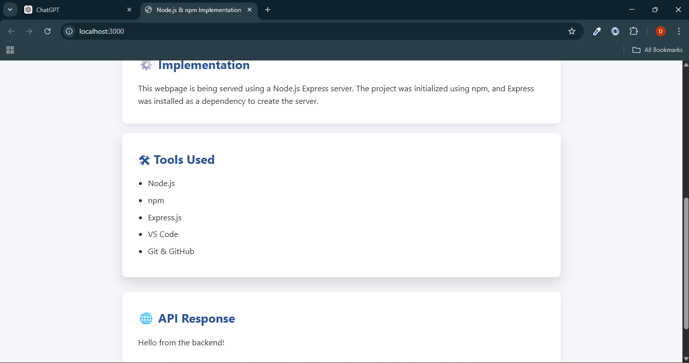
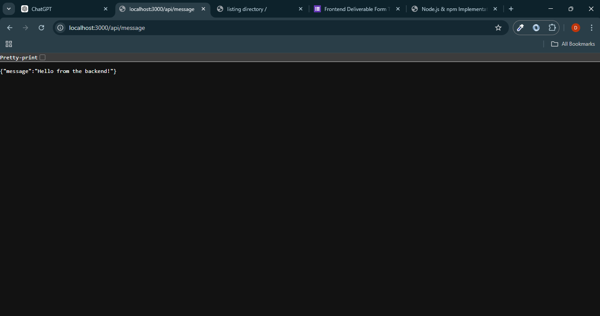

# Node.js & npm Learning Project

## Installation
npm install

## Run
npm start

## What I Learned
- Node.js server creation
- npm dependency management
- Express routing
- Static file serving
- REST API basics

## Screenshots

### Server Running

### Website Output

### API Response
